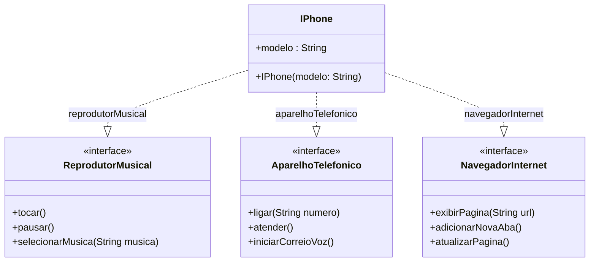

# DIO Java Course Exercise: iPhone Modeling and Implementation

This repository is dedicated to submitting the **[OOP Challenge](https://github.com/digitalinnovationone/trilha-java-basico/tree/main/desafios/poo)** from the **[Java course at Digital Innovation One (DIO)](https://web.dio.me/)**.

## 📌 Challenge Description

The challenge consists of modeling and implementing an **"iPhone"** component using **UML and Java**. The device must support three main functionalities:  

- **Music Player**
- **Phone Call Functions**
- **Web Browser**  

## 🎯 Purpose

- Practice **Object-Oriented Programming (OOP)** concepts  
- Work with **interfaces and class implementation** in Java  
- Use **UML** for system modeling  

## 📋 Class Diagram (UML)

The following UML diagram represents the structure of the classes and interfaces in the project:  



## 🚀 Technologies Used
Java
- UML (Unified Modeling Language)
- OOP (Object-Oriented Programming)
- Interfaces in Java

## ▶️ Running the Project
Clone this repository:
```sh
git clone https://github.com/kelvimro/dio-java-desafio-poo.git
cd dio-java-desafio-poo
```
Compile and run the Java program:
```sh
javac
java
```
