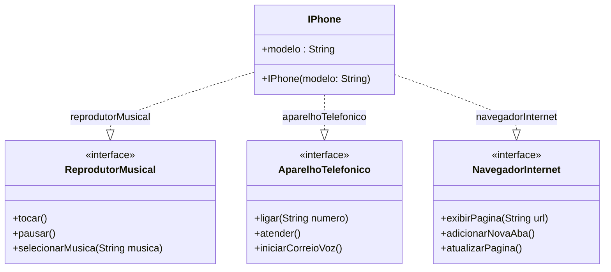

# DIO Java Course Exercise: iPhone Modeling and Implementation

This project is dedicated to submitting the **[OOP Challenge](https://github.com/digitalinnovationone/trilha-java-basico/tree/main/desafios/poo)** from the **[Java course at Digital Innovation One (DIO)](https://web.dio.me/)**.

## 📌 Challenge Description

The challenge consists of modeling and implementing an **"iPhone"** component using **UML and Java**. The device must support three main functionalities:

- **Music Player**
- **Phone Call Functions**
- **Web Browser**

## 🎯 Purpose

- Practice **Object-Oriented Programming (OOP)** concepts
- Work with **interfaces and class implementation** in Java
- Use **UML** for system modeling

## 📋 Class Diagram (UML)

The following UML diagram represents the structure of the classes and interfaces in the project:



## 🚀 Technologies Used

- Java
- UML (Unified Modeling Language)
- OOP (Object-Oriented Programming)
- Interfaces in Java

## ▶️ Running the Project

Clone this repository:

```sh
git clone https://github.com/kelvimro/dio-java-desafio-poo.git
cd dio-java-desafio-poo\iphone\src
```

Compile and run the Java program:

```sh
javac App.java
java app.java
```

## 📌 Example of Execution

Valid Input:

```sh
1
1
4
66 9 9999-9999
2
2
7
github.com/kelvimro
```

Output:

```sh
Tocando música.
A música já está tocando.
Ligando para 66 9 9999-9999
Pausando música
Não há música tocando.
Exibindo página github.com/kelvimro
```
